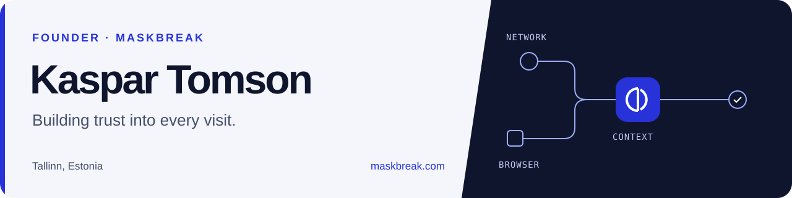

### I build tools that help teams understand who's behind a visit.

I'm Kaspar, founder of **[Maskbreak](https://maskbreak.com)**, based in Tallinn, Estonia.
I'm working on fraud detection that brings network signals and browser context together—so developers can make better decisions at signup, login, and checkout.

[Explore Maskbreak](https://maskbreak.com) · [Read the docs](https://maskbreak.com/api) · [Get a free API key](https://maskbreak.com/signup)

### What I'm building

**Maskbreak** turns a live visit into an `allow`, `review`, or `block` decision, with the signals behind it.
The focus: hidden proxies, fake browsers, automation, and account abuse. A VPN alone is a reason to review—not proof of fraud.

The stack behind it: **Node.js · Express · Cloudflare · Railway · libSQL**.

### Open-source tools

| Project | What it's for | Install |
| :--- | :--- | :--- |
| **[Node.js SDK](https://github.com/sentinelsup/maskbreak-node)** | Add visitor checks to your JavaScript backend | `npm install @sentinelsup/sdk` |
| **[Python SDK](https://github.com/sentinelsup/maskbreak-python)** | Evaluate visits from Python services | `pip install sentinelsup` |
| **[PHP SDK](https://github.com/sentinelsup/maskbreak-php)** | Protect PHP and WordPress endpoints | `composer require sentinelsup/sdk` |
| **[MCP server](https://github.com/sentinelsup/maskbreak-mcp)** | Inspect IP network context from an MCP client | `npx @sentinelsup/mcp` |

The SDKs keep their original `sentinelsup` package names for compatibility.
Browse the projects at **[github.com/sentinelsup](https://github.com/sentinelsup)**.

### Notes & contact

I share practical integration guides and product updates on the **[Maskbreak blog](https://maskbreak.com/blog)**.

[Website](https://maskbreak.com) · [API reference](https://maskbreak.com/api) · [Contact](https://maskbreak.com/contact) · [support@maskbreak.com](mailto:support@maskbreak.com)
